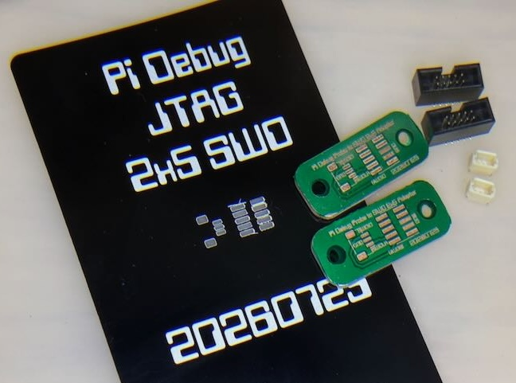
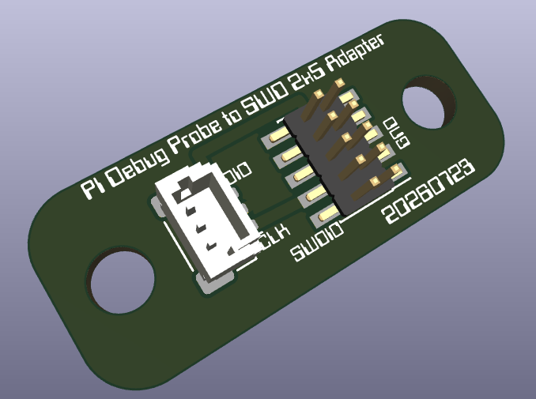
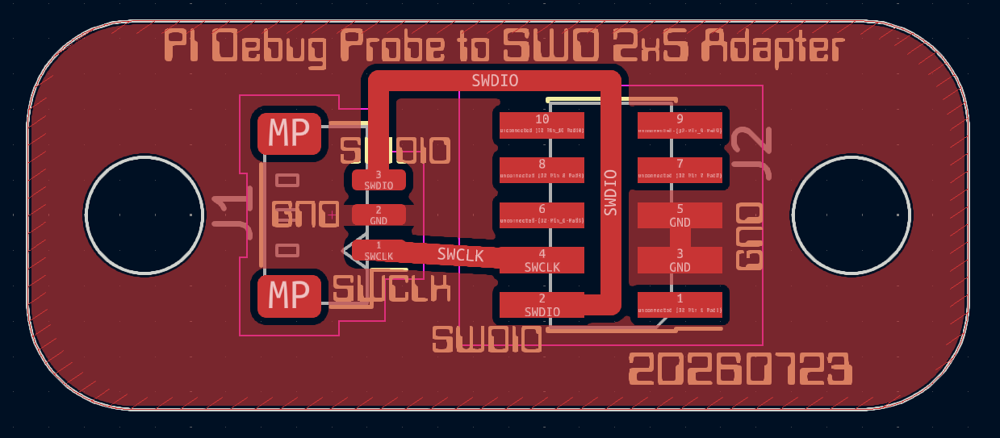
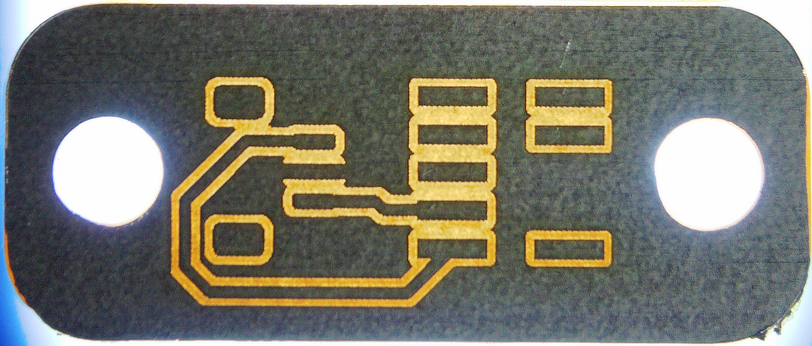
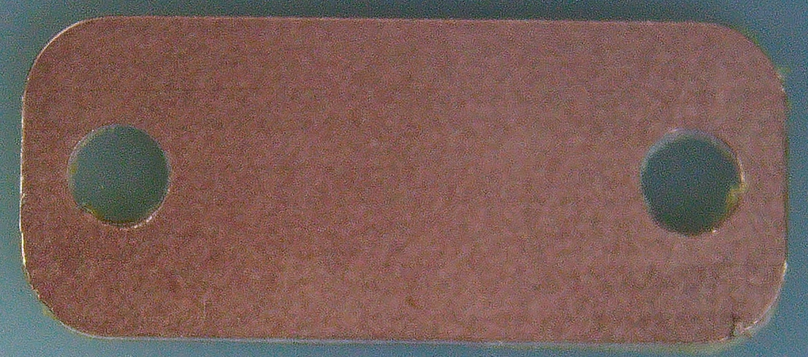

# pi-debug-swd-adapter

Connects the $12 Raspberry Pi Debug Probe to a standard 2x5 SWD connector.

## How it was made

Voice dictated to Claude, which sourced the parts and wrote out the KiCad 
schematic and PCB board file. No MCP server, no skill, no reference 
design.

See [`CLAUDE.md`](CLAUDE.md) for what it was used. This file represents the on-going changes I had Claude 
make after the first pass.

Fabrication: a [Bantam CNC](https://www.bantamtools.com/) to cut the single sided PCB blanks, 
and an xTool F1 Ultra fiber laser to etch, silkscreen, and expose the pads under a green 
resin layer was applied. The steel business card stencil was cut on the same laser.

## About

The [Raspberry Pi Debug Probe](https://www.raspberrypi.com/products/debug-probe/) ends in a
3-pin JST-SH connector. Many Adafruit Metro and Feather boards expose debug on the standard
2x5 1.27 mm SWD header. This board bridges the two.

No active parts — just three signals and a ground pour on a 26.6 × 11 mm single-sided board.

Design files are in [`kicad/`](kicad/).

---

## KiCad 3D render



What the board was supposed to look like before any copper got cut.

## KiCad board layout



The original layout, and the oldest artifact here. The board name is set in copper so it
etches as readable text.

## Etched copper — trace check



A freshly etched board held up to a light to check the traces. All copper is on one side —
no vias.

## CNC-cut blank



The raw blank milled on the Bantam CNC, with rounded corners and two M2.5 mounting holes.

---

## Design files

Designed in [KiCad](https://www.kicad.org/) 9. The project lives in [`kicad/`](kicad/):

- `pico-debug-swd-adapter.kicad_pro` — project file
- `pico-debug-swd-adapter.kicad_sch` — schematic
- `pico-debug-swd-adapter.kicad_pcb` — PCB layout
- `pico-debug-swd-adapter.step` — 3D model export
- `pi-debug-swd_recovered.xcs` — xTool Creative Space laser job
- `3dmodels/` — project-local STEP models
- `etch/etch-FCu-MIRRORED-1to1.pdf` — print at 100% for toner transfer
- `etch/etch-FCu-reference.pdf` — same artwork unmirrored, for checking

## Bill of materials

| Ref | Part | Description |
|---|---|---|
| J1 | JST `BM03B-SRSS-TB` | 3-pin 1.00 mm vertical SMT receptacle |
| J2 | CNC Tech `3220-10-0300-00` | 2x5 1.27 mm shrouded SWD box header, SMT |

Plus two M2.5 screws and a 2x5 1.27 mm ribbon cable.

## Pinout

| Debug Probe "D" (J1) | Cortex Debug 2x5 (J2) |
|---|---|
| 1 — SC | 4 — SWCLK |
| 2 — GND | 3, 5 — GND |
| 3 — SD | 2 — SWDIO |

Everything else on J2 is left unconnected. Use the **"D"** port on the probe, not "U".

## Using it

The Debug Probe shows up as CMSIS-DAP, so no special driver is needed.

```bash
probe-rs run --chip RP2350 target.elf
```

```bash
openocd -f interface/cmsis-dap.cfg -f target/rp2350.cfg -c "adapter speed 5000"
```

---

## License

[GPLv3](LICENSE)
